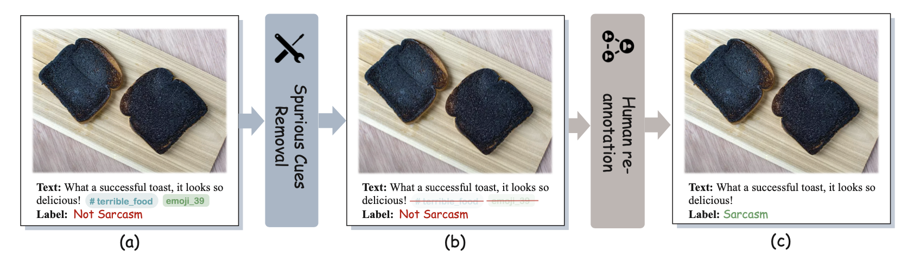
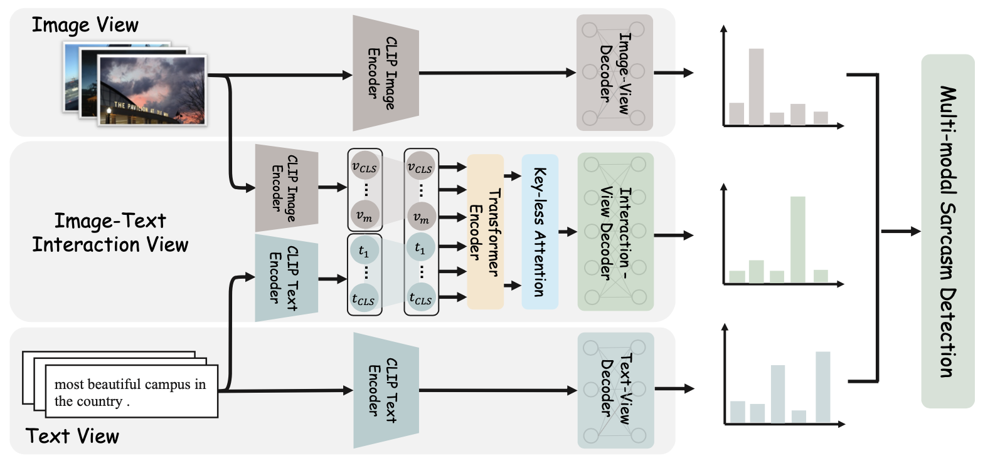
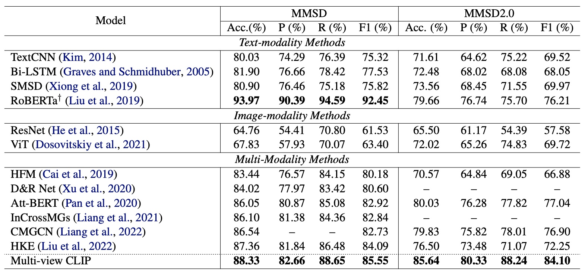

# MMSD2.0: Towards a Reliable Multi-modal Sarcasm Detection System

This repository contains the official `PyTorch` implementation of the paper: [Libo Qin](https://faculty.csu.edu.cn/qinlibo/zh_CN/index.htm), [Shijue Huang](https://joeying1019.github.io/), [Qiguang Chen](https://lightchen233.github.io/), [Chenran Cai](https://github.com/terence1023), [Yudi Zhang](https://github.com/YudiZh), [Bin Liang](https://binliang-nlp.github.io/), [Wanxiang Che](http://ir.hit.edu.cn/~car/zh/) and [Ruifeng Xu](http://faculty.hitsz.edu.cn/xuruifeng).

In the following, we will guide you how to use this repository step by step.

## Abstract

Multi-modal sarcasm detection has attracted much recent attention. Nevertheless, the existing benchmark (MMSD) has some shortcomings that hinder the development of reliable multi-modal sarcasm detection system:(1) There are some spurious cues in MMSD, leading to the model bias learning; (2) The negative samples in MMSD are not always reasonable.To solve the aforementioned issues, we introduce MMSD2.0, a correction dataset that fixes the shortcomings of MMSD, by removing the spurious cues and re-annotating the unreasonable samples.Meanwhile, we present a novel framework called multi-view CLIP that is capable of leveraging multi-grained cues from multiple perspectives (i.e., text, image, and text-image interaction view) for multi-modal sarcasm detection.Extensive experiments show that MMSD2.0 is a valuable benchmark for building reliable multi-modal sarcasm detection systems and multi-view CLIP can significantly outperform the previous best baselines (with a 5.6% improvement).

## Dataset Construction



## Architecture



## Results



## Preparation

Our code is based on PyTorch 1.12 Required python packages:

-   numpy==1.21.6
-   tqdm==4.64.0
-   pytorch==1.12.0
-   python==3.7.4
-   pillow==9.2.0
-   transformers==4.23.1
-   wandb==0.13.3
-   scikit-learn==1.0.2

We highly suggest you using [Anaconda](https://www.anaconda.com/) to manage your python environment. If so, you can run the following command directly on the terminal to create the environment:

```
conda create -n env_name python=3.7.4   
source activate env_name     
pip install -r requirements.txt
```

## How to run it
### image link

Downlaod the image data from [1](https://drive.google.com/file/d/1mK0Nf-jv_h2bgHUCRM4_EsdTiiitZ_Uj/view?usp=sharing_eil&ts=5d480e04) [2](https://drive.google.com/file/d/1AOWzlOz5hmdO39dEmzhQ4z_nabgzi7Tu/view?usp=sharing_eil&ts=5d480e04) [3](https://drive.google.com/file/d/1dJERrVlp7DlNSXk-uvbbG6Rv7uvqTOKd/view?usp=sharing_eil&ts=5d480e04) [4](https://drive.google.com/file/d/1pODuKC4gP6-QDQonG8XTqI8w8ds68mE3/view?usp=sharing_eil&ts=5d480e04), and unzip them into folder `data/dataset_image`

### Text data

MMSD dataset (Original dataset): `data/text_json_clean`

MMSD 2.0 dataset (Our correction dataset):`data/text_json_final`

### Train

The script **main.py** acts as a main function to the project, you can run the experiments by the following commands.

```Shell
# MMSD2.0 dataset (On Tesla V100s)
python3 main.py --model MV_CLIP --text_name text_json_final --weight_decay 0.05 --train_batch_size 32 --dev_batch_size 32 --learning_rate 5e-4 --clip_learning_rate 1e-6 --num_train_epochs 10 --layers 3 --max_grad_norm 5 --dropout_rate 0.1 --optimizer_name adam --text_size 512 --image_size 768 --warmup_proportion 0.2 --device 0 > MV_CLIP_MMSD2.log 2>&1 &

# MMSD dataset (On Tesla V100s)
python3 main.py --model MV_CLIP --text_name text_json_clean --weight_decay 0.005 --train_batch_size 32 --dev_batch_size 32 --learning_rate 3e-4 --clip_learning_rate 3e-7 --num_train_epochs 10 --layers 5 --max_grad_norm 6 --dropout_rate 0.3 --optimizer_name adam --text_size 512 --image_size 768 --warmup_proportion 0.2 --device 0 > MV_CLIP_MMSD.log 2>&1 &
```


## Reference

If you find this project useful for your research, please consider citing the following paper:

```
@inproceedings{qin-etal-2023-mmsd2,
    title = "{MMSD}2.0: Towards a Reliable Multi-modal Sarcasm Detection System",
    author = "Qin, Libo  and
      Huang, Shijue  and
      Chen, Qiguang  and
      Cai, Chenran  and
      Zhang, Yudi  and
      Liang, Bin  and
      Che, Wanxiang  and
      Xu, Ruifeng",
    booktitle = "Findings of the Association for Computational Linguistics: ACL 2023",
    month = jul,
    year = "2023",
    address = "Toronto, Canada",
    publisher = "Association for Computational Linguistics",
    url = "https://aclanthology.org/2023.findings-acl.689",
    pages = "10834--10845",
    abstract = "Multi-modal sarcasm detection has attracted much recent attention. Nevertheless, the existing benchmark (MMSD) has some shortcomings that hinder the development of reliable multi-modal sarcasm detection system: (1) There are some spurious cues in MMSD, leading to the model bias learning; (2) The negative samples in MMSD are not always reasonable. To solve the aforementioned issues, we introduce MMSD2.0, a correction dataset that fixes the shortcomings of MMSD, by removing the spurious cues and re-annotating the unreasonable samples. Meanwhile, we present a novel framework called multi-view CLIP that is capable of leveraging multi-grained cues from multiple perspectives (i.e., text, image, and text-image interaction view) for multi-modal sarcasm detection. Extensive experiments show that MMSD2.0 is a valuable benchmark for building reliable multi-modal sarcasm detection systems and multi-view CLIP can significantly outperform the previous best baselines.",
}
```


If you have any question, please issue the project or email [Shijue Huang](mailto:joehsj310@gmail.com) or [Libo Qin](mailto:lbqin@csu.edu.cn) and we will reply you soon.